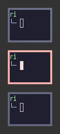
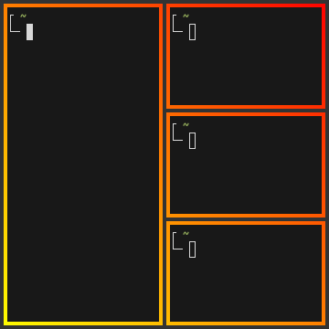
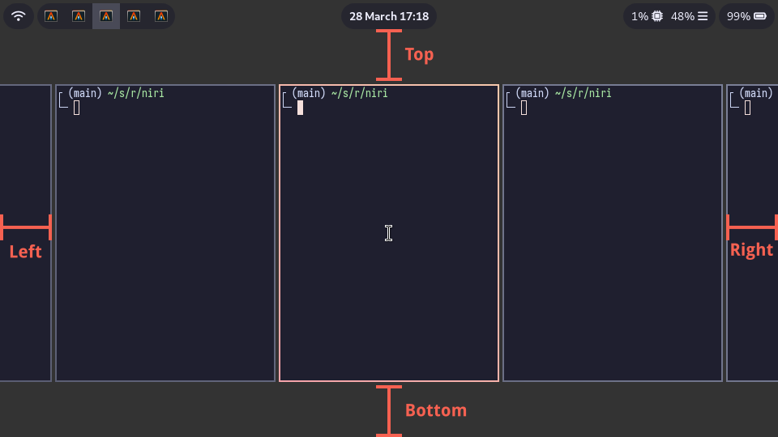

### Overview

In the `layout {}` section you can change various settings that influence how windows are positioned and sized.

Here are the contents of this section at a glance:

```kdl
layout {
    gaps 16
    main-axis "horizontal"
    center-focused-column "never"
    always-center-single-column
    empty-workspace-above-first
    default-column-display "tabbed"
    background-color "#003300"

    preset-column-widths {
        proportion 0.33333
        proportion 0.5
        proportion 0.66667
    }

    default-column-width { proportion 0.5; }

    preset-window-heights {
        proportion 0.33333
        proportion 0.5
        proportion 0.66667
    }

    focus-ring {
        // off
        on
        width 4
        active-color "#7fc8ff"
        inactive-color "#505050"
        urgent-color "#9b0000"
        // active-gradient from="#80c8ff" to="#bbddff" angle=45
        // inactive-gradient from="#505050" to="#808080" angle=45 relative-to="workspace-view"
        // urgent-gradient from="#800" to="#a33" angle=45
    }

    border {
        off
        // on
        width 4
        active-color "#ffc87f"
        inactive-color "#505050"
        urgent-color "#9b0000"
        // active-gradient from="#ffbb66" to="#ffc880" angle=45 relative-to="workspace-view"
        // inactive-gradient from="#505050" to="#808080" angle=45 relative-to="workspace-view" in="srgb-linear"
        // urgent-gradient from="#800" to="#a33" angle=45
    }

    shadow {
        off
        // on
        softness 30
        spread 5
        offset x=0 y=5
        draw-behind-window true
        color "#00000070"
        // inactive-color "#00000054"
    }

    tab-indicator {
        // off
        on
        hide-when-single-tab
        place-within-column
        gap 5
        width 4
        length total-proportion=1.0
        position "right"
        gaps-between-tabs 2
        corner-radius 8
        active-color "red"
        inactive-color "gray"
        urgent-color "blue"
        // active-gradient from="#80c8ff" to="#bbddff" angle=45
        // inactive-gradient from="#505050" to="#808080" angle=45 relative-to="workspace-view"
        // urgent-gradient from="#800" to="#a33" angle=45
    }

    insert-hint {
        // off
        on
        color "#ffc87f80"
        // gradient from="#ffbb6680" to="#ffc88080" angle=45 relative-to="workspace-view"
    }

    struts {
        // left 64
        // right 64
        // top 64
        // bottom 64
    }
}
```

<sup>Since: 25.11</sup> You can override these settings for specific [outputs](./Configuration:-Outputs.md#layout-config-overrides) and [named workspaces](./Configuration:-Named-Workspaces.md#layout-config-overrides).

### `gaps`

Set gaps around (inside and outside) windows in logical pixels.

<sup>Since: 0.1.7</sup> You can use fractional values.
The value will be rounded to physical pixels according to the scale factor of every output.
For example, `gaps 0.5` on an output with `scale 2` will result in one physical-pixel wide gaps.

<sup>Since: 0.1.8</sup> You can emulate "inner" vs. "outer" gaps with negative `struts` values (see the struts section below).

```kdl
layout {
    gaps 16
}
```

### `main-axis`

<sup>Since: next release</sup>

Sets the main axis of the scrolling layout.

- `"horizontal"` (the default): columns are laid out from left to right, and the view scrolls horizontally.
- `"vertical"`: columns are laid out from top to bottom, and the view scrolls vertically.

This setting also changes what niri considers the main axis for size actions and presets:

- `column width` settings and actions affect the main-axis span of a column.
- `window height` settings and actions affect the cross-axis span of a window inside a column.

So in the default horizontal layout these still correspond to physical width and height, while in vertical layout they correspond to physical height and width respectively.

For a portrait monitor next to a landscape monitor, override only that output:

```kdl
output "DP-2" {
    layout {
        main-axis "vertical"
        // Two rows fit in the visible area.
        default-column-width { proportion 0.5; }
    }
}
```

You can also set `main-axis` in a named workspace's `layout` block. Workspace settings
override output settings, which override the global `layout` block. Changes take effect on
config reload, including existing windows. A named workspace keeps its override when moved
to another output; other workspaces inherit their destination output's layout.

Windows within a vertical row sit side by side. Window content stays upright: this option
changes tiling, independently of the output's `transform` setting. Struts, layer-shell
exclusive zones and tab-indicator positions keep their physical screen directions.

Directional focus and move actions keep their screen directions: `focus-window-down`
selects the next row, and `focus-column-right` selects the next window to the right within
a row. Floating windows and screenshot controls also keep their screen directions.
`first`/`last`, column indices, consume/expel and size actions refer to the layout axes;
for example, `consume-or-expel-window-left` consumes into the preceding row in vertical mode.
Workspace up/down actions select the preceding/next workspace; on a vertical workspace,
the overview arranges workspaces horizontally. Scrolling gestures follow these two axes.

Biri's Shift+wheel carousel navigation continues to rotate between monitors. Ordinary
wheel scrolling in the overview follows the layout of the monitor being viewed.

### `center-focused-column`

When to center a column when changing focus.
This can be set to:

- `"never"`: no special centering, focusing an off-screen column will scroll it to the start or end edge of the screen. This is the default.
- `"always"`, the focused column will always be centered.
- `"on-overflow"`, focusing a column will center it if it doesn't fit on screen together with the previously focused column.

```kdl
layout {
    center-focused-column "always"
}
```

### `always-center-single-column`

<sup>Since: 0.1.9</sup>

If set, niri will always center a single column on a workspace, regardless of the `center-focused-column` option.

```kdl
layout {
    always-center-single-column
}
```

### `empty-workspace-above-first`

<sup>Since: 25.01</sup>

If set, niri will always add an empty workspace at the very start, in addition to the empty workspace at the very end.

```kdl
layout {
    empty-workspace-above-first
}
```

### `default-column-display`

<sup>Since: 25.02</sup>

Sets the default display mode for new columns.
Can be `normal` or `tabbed`.

```kdl
// Make all new columns tabbed by default.
layout {
    default-column-display "tabbed"

    // You may also want to hide the tab indicator
    // when there's only a single window in a column.
    tab-indicator {
        hide-when-single-tab
    }
}
```

### `preset-column-widths`

Set the main-axis spans that the `switch-preset-column-width` action (Mod+R) toggles between.
<sup>Since: 25.08</sup> You can use the `switch-preset-column-width-back` action (Mod+Shift+R) to toggle in reverse.

`proportion` sets the span as a fraction of the output along the main axis, taking gaps into account.
For example, you can perfectly fit four windows sized `proportion 0.25` along the main axis of an output, regardless of the gaps setting.
The default preset spans are <sup>1</sup>&frasl;<sub>3</sub>, <sup>1</sup>&frasl;<sub>2</sub> and <sup>2</sup>&frasl;<sub>3</sub> of the output along the main axis.

`fixed` sets the window span on the main axis in logical pixels exactly.

```kdl
layout {
    // Cycle between 1/3, 1/2, 2/3 of the output, and a fixed 1280 logical pixels.
    preset-column-widths {
        proportion 0.33333
        proportion 0.5
        proportion 0.66667
        fixed 1280
    }
}
```

### `default-column-width`

Set the default main-axis span of new windows.

The syntax is the same as in `preset-column-widths` above.

```kdl
layout {
    // Open new windows sized 1/3 of the output along the main axis.
    default-column-width { proportion 0.33333; }
}
```

You can also leave the brackets empty, then the windows themselves will decide their initial main-axis span.

```kdl
layout {
    // New windows decide their initial main-axis span themselves.
    default-column-width {}
}
```

> [!NOTE]
> `default-column-width {}` causes niri to send an initial configure request with the main-axis span left at 0 and the cross-axis span set normally.
>
> In the default horizontal layout this is `(0, H)`. With `main-axis "vertical"`, this becomes `(W, 0)`.
>
> This is a bit [unclearly defined](https://gitlab.freedesktop.org/wayland/wayland-protocols/-/issues/155) in the Wayland protocol, so some clients may misinterpret it.
> Either way, `default-column-width {}` is most useful for specific windows, in form of a [window rule](./Configuration:-Window-Rules.md#default-column-width) with the same syntax.

### `preset-window-heights`

<sup>Since: 0.1.9</sup>

Set the cross-axis spans that the `switch-preset-window-height` action (Mod+Ctrl+Shift+R) toggles between.
<sup>Since: 25.08</sup> You can use the `switch-preset-window-height-back` action (not bound by default) to toggle in reverse.

`proportion` sets the span as a fraction of the output along the cross axis, taking gaps into account.
The default preset cross-axis spans are <sup>1</sup>&frasl;<sub>3</sub>, <sup>1</sup>&frasl;<sub>2</sub> and <sup>2</sup>&frasl;<sub>3</sub> of the output along the cross axis.

`fixed` sets the cross-axis span in logical pixels exactly.

```kdl
layout {
    // Cycle between 1/3, 1/2, 2/3 of the output, and a fixed 720 logical pixels.
    preset-window-heights {
        proportion 0.33333
        proportion 0.5
        proportion 0.66667
        fixed 720
    }
}
```

### `focus-ring` and `border`

Focus ring and border are drawn around windows and indicate the active window.
They are very similar and have the same options.

The difference is that the focus ring is drawn only around the active window, whereas borders are drawn around all windows and affect their sizes (windows shrink to make space for the borders).

| Focus Ring                | Border                |
| ------------------------- | --------------------- |
|  |  |

> [!TIP]
> By default, focus ring and border are rendered as a solid background rectangle behind windows.
> That is, they will show up through semitransparent windows.
> This is because windows using client-side decorations can have an arbitrary shape.
>
> If you don't like that, you should uncomment the [`prefer-no-csd` setting](./Configuration:-Miscellaneous.md#prefer-no-csd) at the top level of the config.
> Niri will draw focus rings and borders *around* windows that agree to omit their client-side decorations.
>
> Alternatively, you can override this behavior with the [`draw-border-with-background` window rule](./Configuration:-Window-Rules.md#draw-border-with-background).

Focus ring and border have the following options.

```kdl
layout {
    // focus-ring has the same options.
    border {
        // Uncomment this line to disable the border.
        // off

        // Width of the border in logical pixels.
        width 4

        active-color "#ffc87f"
        inactive-color "#505050"

        // Color of the border around windows that request your attention.
        urgent-color "#9b0000"

        // active-gradient from="#ffbb66" to="#ffc880" angle=45 relative-to="workspace-view"
        // inactive-gradient from="#505050" to="#808080" angle=45 relative-to="workspace-view" in="srgb-linear"
    }
}
```

#### Width

Set the thickness of the border in logical pixels.

<sup>Since: 0.1.7</sup> You can use fractional values.
The value will be rounded to physical pixels according to the scale factor of every output.
For example, `width 0.5` on an output with `scale 2` will result in one physical-pixel thick borders.

```kdl
layout {
    border {
        width 2
    }
}
```

#### Colors

Colors can be set in a variety of ways:

- CSS named colors: `"red"`
- RGB hex: `"#rgb"`, `"#rgba"`, `"#rrggbb"`, `"#rrggbbaa"`
- CSS-like notation: `"rgb(255, 127, 0)"`, `"rgba()"`, `"hsl()"` and a few others.

`active-color` is the color of the focus ring / border around the active window, and `inactive-color` is the color of the focus ring / border around all other windows.

The *focus ring* is only drawn around the active window on each monitor, so with a single monitor you will never see its `inactive-color`.
You will see it if you have multiple monitors, though.

There's also a *deprecated* syntax for setting colors with four numbers representing R, G, B and A: `active-color 127 200 255 255`.

#### Custom focus-ring and border shaders

Biri can load a separate GLSL file for each application's active focus ring or border. No rebuild is needed to add or edit shader effects once the compositor supports this feature.

Copy the `resources/shaders/focus-ring/` directory from this repository to `~/.config/niri/focus-ring/`. This example uses the wax-like rainbow effect on Ghostty and a simpler cyan pulse on Firefox:

```kdl
window-rule {
    match app-id=r#"^com\.mitchellh\.ghostty$"#
    focus-ring {
        on
        width 6
        shader {
            path "~/.config/niri/focus-ring/rainbow-ripple.frag"
            padding 14
        }
    }
}
window-rule {
    match app-id=r#"^firefox$"#
    focus-ring {
        on
        width 4
        shader {
            path "~/.config/niri/focus-ring/pulse.frag"
            speed 0.5
        }
    }
}
```

A `shader` block also works in the global layout, output/workspace layouts, and `border` blocks. A window rule replaces the entire inherited shader block; omitted settings take their defaults. Use `shader { enable false; }` to restore normal colours. An explicit `shader` block takes precedence over the legacy `rainbow-ripple` option, including when disabled or invalid.

| Setting | Default | Meaning |
| --- | --- | --- |
| `path` | unset | GLSL file; `~` expands to your home, relative paths resolve beside the config/include file containing the block. |
| `source` | unset | Inline GLSL instead of a file. Use exactly one of `path` or `source` when enabled. |
| `enable` | `true` | Disable an inherited shader with `false`. |
| `animated` | `true` | Use `false` for a static shader: time stays zero and it requests no animation frames. |
| `speed` | `1.0` | Time multiplier, 0–10; zero freezes at time zero. |
| `padding` | `0` | Extra drawing space beyond the nominal ring width, 0–1024 logical pixels. Reserve enough for outward deformations; it does not affect window layout. |
| `light` | absent (off) | Optional light spill from bright ring pixels; see below. |

**Reloading:** shader files are watched along with the config (checked every 500 ms), including files referenced from includes. Saving a `.frag` file reloads it even if the KDL is unchanged. You can also force a reload with `niri msg action load-config-file`. Missing files and GLSL compilation errors are logged and fall back to configured colours; fixing the file restores the shader automatically. Other windows keep their own shaders.

Effects apply to active decorations; inactive and urgent decorations retain their configured colours/gradients. Animation follows `shader-animation-max-fps` and stops when decorations are hidden or suppressed by fullscreen/maximized windows. `animations { off; }` freezes shader time. Continuous animation adds idle GPU work.

##### Light spilling onto windows

Add `light` to an existing file-based or inline decoration shader to illuminate the focused window and neighbouring windows. The bundled `lightning.frag` has a travelling blue-white pulse; its bright head supplies the light automatically. Existing shaders need no new GLSL function or uniforms.

```kdl
window-rule {
    match app-id="^foot$"
    focus-ring {
        on
        width 6
        shader {
            path "~/.config/niri/focus-ring/lightning.frag"
            padding 24
            light spread=80 intensity=1.0 threshold=0.5
        }
    }
}
```

A bare `light` uses the defaults above. These are properties on the `light` node:

| Property | Default | Meaning |
| --- | --- | --- |
| `enable` | `true` | Set `false` to disable spill while retaining the ring. |
| `spread` | `80` | Glow spread in logical pixels, 1–256. The soft tail extends beyond this nominal distance. |
| `intensity` | `1.0` | Brightness multiplier, 0–4. Zero disables spill. |
| `threshold` | `0.5` | Brightness cutoff, 0–1, measured from the brightest premultiplied RGB channel after ring opacity. Lower it to include dimmer areas; raise it to isolate highlights. |

Saving the config updates these settings immediately. The compositor extracts the ring's bright pixels at the same animation time, diffuses them, and screen-blends the resulting colour over window content. This produces bloom and local illumination, without ray tracing, reflections, occlusion shadows, or access to a window texture from the shader. The ring itself remains hollow; the separate light layer can extend inward and outward. `padding` still controls ring geometry independently of the light's spread.

Light is drawn above window content, including floating and sticky windows, following the existing scene order relative to shell surfaces and compositor overlays. In the normal desktop view it stays below top/overlay shell surfaces. It follows the window during movement and overview scaling. Fully expanded/fullscreen decorations, inactive/urgent rings, and invalid shaders do not emit light. Spill is suppressed during window-opening transforms and is not baked into closing snapshots. Output captures include it through the normal decoration path; isolated window captures do not include this scene lighting.

Lighting is opt-in and adds a half-resolution emission pass plus blur passes for each visible lit decoration. Static emission reuses its blurred texture; animated effects follow the existing shader frame cap. Wider spread and larger windows require more texture memory and GPU work. Float blur textures avoid banding where supported, with lower-precision fallbacks for other drivers.

##### Inward-growing rings

Set `draw-inside true` inside `shader` to allow a ring to grow over the client.
The decoration renders above window content and below popups, with its actual
window size and corner radii. The same shader produces both the inward and
outward parts, independently of any window content shader. Padding still reserves
only the outside envelope. This is opt-in and follows the normal active-ring,
urgent, fullscreen, and maximized rules.

```kdl
layout {
    focus-ring {
        width 6
        shader {
            path "shaders/focus-ring/flowering-vine.frag"
            padding 8
            draw-inside true
        }
    }
}
```

Bundled presets enable this for flowering vines, faerie magic, rainbow bleed,
neon bleed, lava portals, and scribbling pencils. Ordinary hollow shaders and
the legacy rainbow ripple remain unchanged.

##### Writing a shader

Provide a GLES2 / GLSL ES 1.00 function returning **straight (not premultiplied) RGBA**:

```glsl
vec4 ring_color(vec2 coords) {
    float distance = ring_distance(coords);
    float half_px = 0.5 / niri_scale;
    float coverage = smoothstep(-half_px, half_px, distance)
        * (1.0 - smoothstep(ring_width - half_px, ring_width + half_px, distance));
    vec3 colour = vec3(0.2, 0.8, 1.0) * (0.75 + 0.25 * sin(niri_time * 2.0));
    return vec4(colour, coverage);
}
```

Do not supply `#version` or `main()`: the compositor wraps your function, preserves the configured colour/gradient opacity, applies window opacity once, and prevents painting inside the client unless `draw-inside true` is set. Shape the outer silhouette and antialias its edges in your shader. Pixels outside the reserved `width + padding` envelope are clipped. All eight ring pieces share window coordinates, so effects can flow continuously around corners.

| Symbol | Meaning |
| --- | --- |
| `coords` | Logical pixels from the client top-left, X right and Y down; negative coordinates are outside the client. |
| `ring_size` | Client width and height in logical pixels. |
| `ring_width` | Configured nominal ring width in logical pixels. |
| `ring_padding` | Reserved extra drawing space (rounded to output pixels, including an antialias margin). |
| `ring_radius` | Client corner radii: top-left, top-right, bottom-right, bottom-left. |
| `ring_distance(coords)` | Signed distance from the rounded client edge; positive outside. |
| `ring_base_color(coords)` | Configured colour/gradient as straight RGBA; its opacity is also applied by the wrapper. |
| `niri_time` | Layout-clock seconds multiplied by `speed`; zero for static/frozen shaders. |
| `niri_scale` | Output scale, for antialiasing logical-pixel distances. |

These shaders shade decorations, with no window-content sampler. They use the normal decoration rendering/capture path and work on TTY, nested, and headless backends. The [global shader](./Configuration:-Global-Shader.md) contract and its capture restrictions do not apply here.

#### Rainbow ripple

This compatibility shorthand selects the bundled wax-like rainbow effect. To edit the effect itself or give applications different shader files, use the [file-based shader block](#custom-focus-ring-and-border-shaders) above.

Biri can animate the active focus ring with flowing pastel rainbow colours, uneven wax-like edges and drifting highlights:

```kdl
layout {
    focus-ring {
        width 6
        rainbow-ripple speed=1.0 strength=0.75 brightness=1.0
    }
}

// Optional: cap idle shader animation, including the focus ring.
shader-animation-max-fps 60
```

The effect is opt-in; omitting `rainbow-ripple` preserves the normal colours and gradients.
A bare `rainbow-ripple` uses the defaults shown above.

| Property | Default | Range | Meaning |
| --- | --- | --- | --- |
| `enable` | `true` | `true` / `false` | Enable the effect; `false` restores configured colours and gradients. |
| `speed` | `1.0` | 0–10 | Multiple of the default four-second cycle; `0` freezes it. |
| `strength` | `0.75` | 0–1 | Deformation of both edges and thickness; `0` keeps the outline steady. |
| `brightness` | `1.0` | 0–2 | Colour brightness multiplier. |

The effect replaces the active colour or gradient's RGB, preserving its opacity.
Inactive and urgent decorations keep their configured colours or gradients.
The animated ring has a hollow centre, including behind transparent windows, and outward waves do not change window sizes.
Widths around 6–8 logical pixels make the ripples easier to see.

The same option works in `border` and in window-rule `focus-ring` / `border` blocks.
A rule's `rainbow-ripple` replaces the complete effect settings; omitted properties use the defaults.
Use `rainbow-ripple enable=false` in a rule to disable an inherited effect.

Animation runs only while an affected decoration is on screen, stops for fully maximized/fullscreen windows, and uses `shader-animation-max-fps` alongside other animated shaders.
With `animations { off; }`, the rainbow is static.
Continuous animation adds idle GPU work; the frame-rate cap limits how often an otherwise idle output redraws.

#### Gradients

Similarly to colors, you can set `active-gradient` and `inactive-gradient`, which will take precedence.

Gradients are rendered the same as CSS [`linear-gradient(angle, from, to)`](https://developer.mozilla.org/en-US/docs/Web/CSS/gradient/linear-gradient).
The angle works the same as in `linear-gradient`, and is optional, defaulting to `180` (top-to-bottom gradient).
You can use any CSS linear-gradient tool on the web to set these up, like [css-gradient.com](https://www.css-gradient.com/).

```kdl
layout {
    focus-ring {
        active-gradient from="#80c8ff" to="#bbddff" angle=45
    }
}
```

Gradients can be colored relative to windows individually (the default), or to the whole view of the workspace.
To do that, set `relative-to="workspace-view"`.
Here's a visual example:

| Default                          | `relative-to="workspace-view"`                      |
| -------------------------------- | --------------------------------------------------- |
|  |  |

```kdl
layout {
    border {
        active-gradient from="#ffbb66" to="#ffc880" angle=45 relative-to="workspace-view"
        inactive-gradient from="#505050" to="#808080" angle=45 relative-to="workspace-view"
    }
}
```

<sup>Since: 0.1.8</sup> You can set the gradient interpolation color space using syntax like `in="srgb-linear"` or `in="oklch longer hue"`.
Supported color spaces are:

- `srgb` (the default),
- `srgb-linear`,
- `oklab`,
- `oklch` with `shorter hue` or `longer hue` or `increasing hue` or `decreasing hue`.

They are rendered the same as CSS.
For example, `active-gradient from="#f00f" to="#0f05" angle=45 in="oklch longer hue"` will look the same as CSS `linear-gradient(45deg in oklch longer hue, #f00f, #0f05)`.


```kdl
layout {
    border {
        active-gradient from="#f00f" to="#0f05" angle=45 in="oklch longer hue"
    }
}
```

### `shadow`

<sup>Since: 25.02</sup>

Shadow rendered behind a window.

Set `on` to enable the shadow.

`softness` controls the shadow softness/size in logical pixels, same as [CSS box-shadow] *blur radius*.
Setting `softness 0` will give you hard shadows.

`spread` is the distance to expand the window rectangle in logical pixels, same as CSS box-shadow spread.
<sup>Since: 25.05</sup> Spread can be negative.

`offset` moves the shadow relative to the window in logical pixels, same as CSS box-shadow offset.
For example, `offset x=2 y=2` will move the shadow 2 logical pixels downwards and to the right.

Set `draw-behind-window` to `true` to make shadows draw behind the window rather than just around it.
Note that niri has no way of knowing about the CSD window corner radius.
It has to assume that windows have square corners, leading to shadow artifacts inside the CSD rounded corners.
This setting fixes those artifacts.

However, instead you may want to set `prefer-no-csd` and/or `geometry-corner-radius`.
Then, niri will know the corner radius and draw the shadow correctly, without having to draw it behind the window.
These will also remove client-side shadows if the window draws any.

`color` is the shadow color and opacity.

`inactive-color` lets you override the shadow color for inactive windows; by default, a more transparent `color` is used.

Shadow drawing will follow the window corner radius set with the [`geometry-corner-radius` window rule](./Configuration:-Window-Rules.md#geometry-corner-radius).

> [!NOTE]
> Currently, shadow drawing only supports matching radius for all corners. If you set `geometry-corner-radius` to four values instead of one, the first (top-left) corner radius will be used for shadows.

```kdl
// Enable shadows.
layout {
    shadow {
        on
    }
}

// Also ask windows to omit client-side decorations, so that
// they don't draw their own window shadows.
prefer-no-csd
```

[CSS box-shadow]: https://developer.mozilla.org/en-US/docs/Web/CSS/box-shadow

### `tab-indicator`

<sup>Since: 25.02</sup>

Controls the appearance of the tab indicator that appears next to columns in tabbed display mode.

Set `off` to hide the tab indicator.

Set `hide-when-single-tab` to hide the indicator for tabbed columns that only have a single window.

Set `place-within-column` to put the tab indicator "within" the column, rather than outside.
This will include it in column sizing and avoid overlaying adjacent columns.

`gap` sets the gap between the tab indicator and the window in logical pixels.
The gap can be negative, this will put the tab indicator on top of the window.

`width` sets the thickness of the indicator in logical pixels.

`length` controls the length of the indicator.
Set the `total-proportion` property to make tabs take up this much length relative to the window size.
By default, the tab indicator has length equal to half of the window size, or `length total-proportion=0.5`.

`position` sets the position of the tab indicator relative to the window.
It can be `left`, `right`, `top`, or `bottom`.

`gaps-between-tabs` controls the gap between individual tabs in logical pixels.

`corner-radius` sets the rounded corner radius for tabs in the indicator in logical pixels.
When `gaps-between-tabs` is zero, only the first and the last tabs have rounded corners, otherwise all tabs do.

`active-color`, `inactive-color`, `urgent-color`, `active-gradient`, `inactive-gradient`, `urgent-gradient` let you override the colors for the tabs.
They have the same semantics as the border and focus ring colors and gradients.

Tab colors are picked in this order:

1. Colors from the `tab-indicator` window rule, if set.
1. Colors from the `tab-indicator` layout options, if set (you're here).
1. If neither are set, niri picks the color matching the window border or focus ring, whichever one is active.

```kdl
// Make the tab indicator wider and match the window height,
// also put it at the top and within the column.
layout {
    tab-indicator {
        width 8
        gap 8
        length total-proportion=1.0
        position "top"
        place-within-column
    }
}
```

### `insert-hint`

<sup>Since: 0.1.10</sup> 

Settings for the window insert position hint during an interactive window move.

`off` disables the insert hint altogether.

`color` and `gradient` let you change the color of the hint and have the same syntax as colors and gradients in border and focus ring.

```kdl
layout {
    insert-hint {
        // off
        color "#ffc87f80"
        gradient from="#ffbb6680" to="#ffc88080" angle=45 relative-to="workspace-view"
    }
}
```

### `struts`

Struts shrink the area occupied by windows, similarly to layer-shell panels.
You can think of them as a kind of outer gaps.
They are set in logical pixels.

Left and right struts will cause the next window to the side to always peek out slightly.
Top and bottom struts will simply add outer gaps in addition to the area occupied by layer-shell panels and regular gaps.

<sup>Since: 0.1.7</sup> You can use fractional values.
The value will be rounded to physical pixels according to the scale factor of every output.
For example, `top 0.5` on an output with `scale 2` will result in one physical-pixel wide top strut.

```kdl
layout {
    struts {
        left 64
        right 64
        top 64
        bottom 64
    }
}
```



<sup>Since: 0.1.8</sup> You can use negative values.
They will push the windows outwards, even outside the edges of the screen.

You can use negative struts with matching gaps value to emulate "inner" vs. "outer" gaps.
For example, use this for inner gaps without outer gaps:

```kdl
layout {
    gaps 16

    struts {
        left -16
        right -16
        top -16
        bottom -16
    }
}
```

### `background-color`

<sup>Since: 25.05</sup>

Set the default background color that niri draws for workspaces.
This is visible when you're not using any background tools like swaybg.

```kdl
layout {
    background-color "#003300"
}
```

You can also set the color per-output [in the output config](./Configuration:-Outputs.md#layout-config-overrides).
